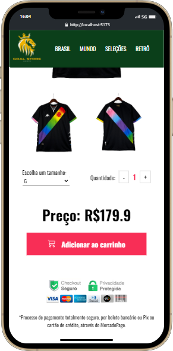

# Goal Store Shirts - parte Frontend

### Sobre: 

Neste projeto pessoal, utilizei uma combinação de tecnologias de ponta, incluindo React para o frontend, Node.js para o backend e MongoDB como banco de dados. No backend, desenvolvi minha própria API dedicada a camisetas de times de futebol e integrei-a de forma eficaz ao frontend. Isso me permitiu criar diversas páginas na aplicação de acordo com os requisitos específicos de cada uma delas. Um aspecto chave deste projeto foi a integração com o MongoDB, que me permitiu estabelecer um sólido esquema para armazenar informações de usuários no banco de dados. Isso possibilitou a criação de um formulário de registro e login para os usuários da aplicação. Uma vez que um usuário faz o login em sua conta, ele ganha acesso completo a todas as funcionalidades da aplicação sem a necessidade de se desconectar. Para os visitantes que optam por não criar uma conta, eles ainda podem explorar o projeto, mas a funcionalidade de adicionar produtos ao carrinho fica restrita. Adicionalmente, os usuários não logados são impedidos de acessar áreas restritas destinadas a usuários autenticados.

### Tecnologias Utilizadas:

React, Node.js e MongoDB.

### Acesse o projeto completo:

https://goal-store-frontend.vercel.app/

# Previa do Projeto nas versões para Desktop, Tablet e Mobile:

### DESKTOP VERSION
 

---

### TABLET VERSION
 

---

### MOBILE VERSION

