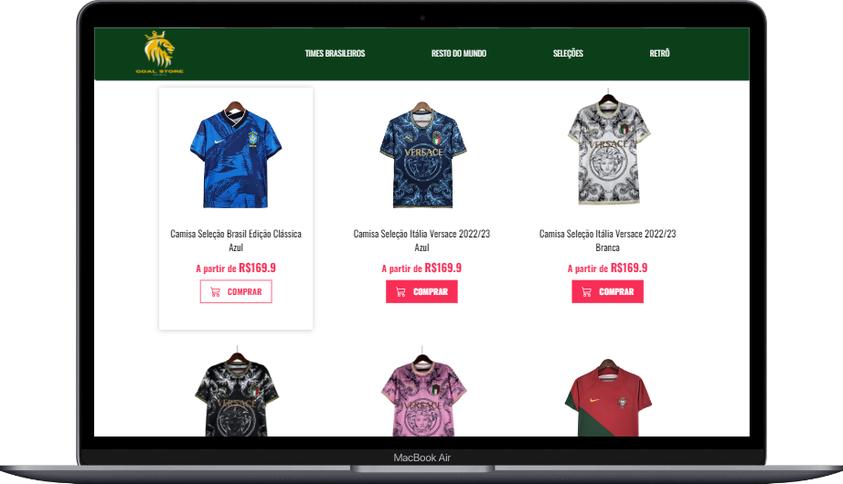
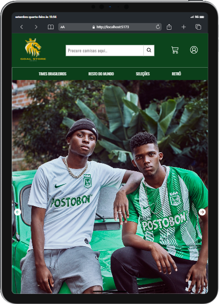
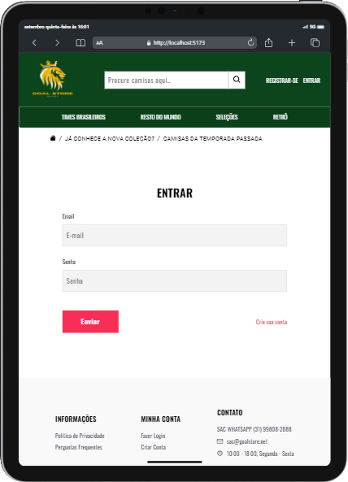
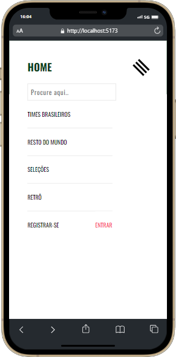

# Goal Store Shirts - parte Frontend

### Backend:

    Primeiro certifique-se que o Goal-Store-Backend está rodando;
    Acesse e clone o repositório: https://github.com/Hashtag-igor/Goal-Store-Backend;
    Após clonar-lo, abra o repositório no VSCode, vá no terminal e digite: npm run server;
    Após fazer isso, deixe o VSCode aberto e abra em outro VSCode o Goal-Store-Frontend;

### Frontend:

    Vá no terminal e digite: npm run dev;

### Resumo:

    Com o Backend rodando, no seu frontend você consiguirá consumir a API dos produtos e dos usuarios do seu backend;

# Previa do Projeto nas versões para Desktop, Tablet e Mobile:

### DESKTOP VERSION
 

---

### TABLET VERSION
 
 

---

### MOBILE VERSION

